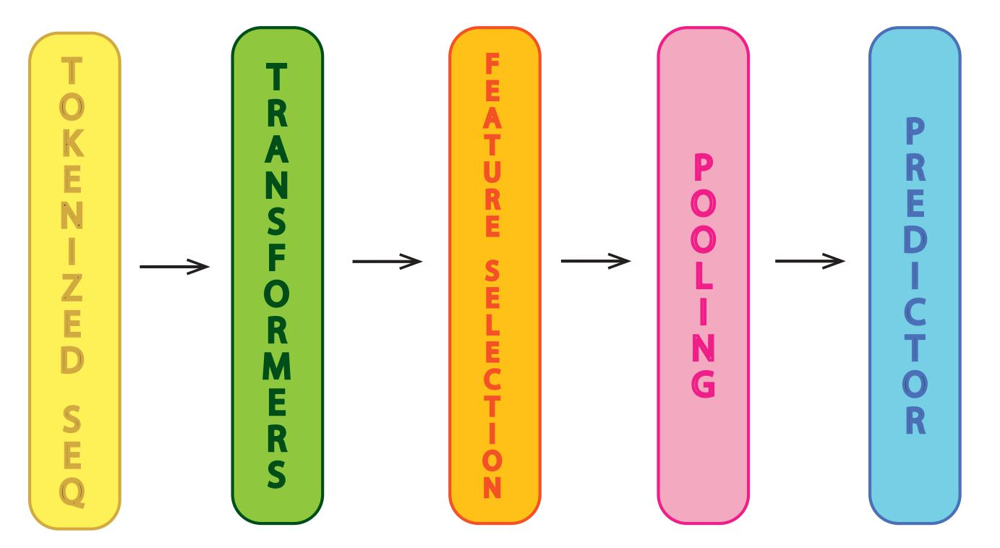

# Optimizing Learned Representations from Protein Language Models

Proteins are fundamental macromolecules central to cellular structure, function, and regulation across all living organisms. Given their diverse roles, accurate functional annotation is essential for biomedical research, disease characterization, and drug development. However, wet-lab approaches for annotating protein functions require significant time and resources. Recent advances in computational biology, particularly the use of large pretrained protein language models (PLMs), have enhanced protein function and structure prediction via transfer learning, repurposing learned representations for downstream tasks.
The representations derived from PLMs are high-dimensional vectors that, for some subsequent training tasks, require dimensionality reduction. Common strategies such as mean and max pooling are widely used for dimensionality reduction, though their effectiveness remains empirically driven and theoretically underexplored. This thesis investigates multiple strategies for compactly representing protein sequence embeddings derived from pretrained language models and evaluates their effectiveness in the downstream task of Gene Ontology (GO) function prediction, formulated as a multi-label classification problem.
Experimental results confirm that PLM-based representations enhance GO prediction performance, even when only 60\% of the feature vector is retained—highlighting the robustness and redundancy of contextualized embeddings in Transformer-based models.The study finds that mean pooling consistently outperforms max pooling as a fixed aggregation strategy for protein sequence embeddings. However, when learnable dimensionality reduction layers are incorporated into the downstream architecture, the model adapts its representations through task-specific fine-tuning—resulting in comparable performance across both pooling methods. Interestingly, representations from newer PLM architectures do not consistently outperform earlier models; in some cases, lower-level embeddings yield better generalization. This observation suggests that further refinement of pretraining objectives may be needed to align model representations with functional annotation tasks.

### Workflow Steps

 

  

1. Input Sequence Preparation
Description: Prepare the protein sequences to be processed by the PLMs.
Steps:
Collect and format protein sequences in FASTA files.
Organize the sequences into a directory or file structure for batch processing.
2. Sequence Representation Extraction with PLMs
Description: Use ESM, ProstT5 to convert sequences into feature-rich vector representations.
Steps:
Choose a PLM (ESM, ProstT5) and load its pretrained model.
Tokenize the sequences as required by the chosen PLM.
Pass the sequences through the model to extract embeddings (hidden states).
Save the extracted representations for downstream analysis.
3. Feature Selection
Description: Select relevant residues to downstream task of GO classification.
Steps:
Use a feature selection criterion (ASA, logit, random).
Apply the feature selection method to embeddings:
Eliminate residues.
Retain key residues based on the selected criterion.
Save the pruned representations for pooling.
4. Pooling
Description: Aggregate or summarize the selected features into a fixed-length vector.
Steps:
Choose a pooling strategy (average pooling, max pooling).
Implement the pooling operation over the selected residues.
Save the pooled representations for model training.
5. Model Training for GO Prediction
Description: Train a predictive model using the processed representations.
Steps:
Define the downstream task (GO term prediction).
Split the data into training, and test sets.
Choose a model architecture (feedforward neural network).
Train the model using the pooled representations:
Use loss functions (cross-entropy for classification).
Optimize hyperparameters (learning rate, regularization).
Evaluate model performance using metrics such as F1-score, precision, and recall.
6. Evaluation and Results
Description: Assess the model's performance and summarize results.
Steps:
Generate evaluation metrics for the test set.
Compare performance across different feature selection and pooling strategies.
